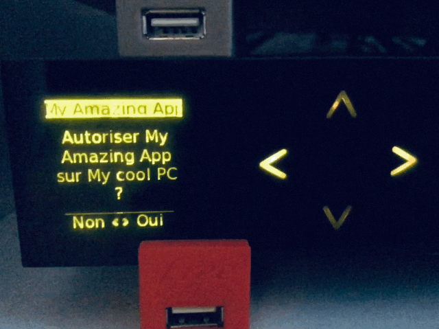

# Freebox for Node.js 

> Simple authentification and secure requests to your Freebox OS server

[](https://travis-ci.org/matschik/freebox) [](https://badge.fury.io/js/freebox) [](https://github.com/facebook/jest) [](https://github.com/xojs/xo)

## Why ?

From Freebox OS API documentation (https://dev.freebox.fr/sdk/os), register and authentification processes are quite difficult to set up. This little library simplify and automate all the hard authentification stuff to being able to request your Freebox from anywhere using HTTPS protocol.

## Install

```
$ npm install freebox
```

## Usage

Official Freebox OS API Documentation: https://dev.freebox.fr/sdk/os

Tested on:

- Freebox Revolution V6

_If you tested on your Freebox and the device model is not in this list, please open an issue and I will add it in the list._

### Register your app

Just one time per app !
You must be connected to your Freebox local network to register an app.<br>
Go to https://mafreebox.freebox.fr. If it's working, you are on your Freebox local network.

**Note:** You can not register an app using a remote HTTPS freebox server domain like `r42bhm9p.fbxos.fr`.

<p align="center">
  <br>
    
    <br>
    <i>Freebox server LCD screen to authorize your app access.</i>
	<br>
  <br>
</p>

```js
const { FreeboxRegister } = require("freebox");

async function main() {
  const freeboxRegister = new FreeboxRegister({
    app_id: "fbx.my_amazing_app",
    app_name: "My Amazing App",
    app_version: "1.0.0",
    device_name: "My cool PC",
  });

  // Obtaining an app_token & everything you need
  // https://dev.freebox.fr/sdk/os/login/
  const access = await freeboxRegister.register();
}

main().catch(err => console.error(err));

/*

Please check your Freebox Server LCD screen and authorize application access to register your app.

Your app has been granted access !

Save safely those following informations secret to connect to your Freebox API:
{ app_token:
   'etCEF2aytGPLWm1KZM0vIW/ziZOU58v/0qv9jUiJcedjadjaRZ/bflWSKy6HODORGUo6',
  app_id: 'fbx.my_amazing_app',
  api_domain: 'r42bhm9p.fbxos.fr',
  https_port: 35023,
  api_base_url: '/api/',
  api_version: '6.0' }

*/
```

### Login & request your Freebox server

```js
const { Freebox } = require("freebox");

async function main() {
  const freebox = new Freebox({
    app_token:
      "etCEF2aytGPLWm1KZM0vIW/ziZOU58v/0qv9jUiJcedjadjaRZ/bflWSKy6HODORGUo6",
    app_id: "fbx.my_amazing_app",
    api_domain: "r42bhm9p.fbxos.fr",
    https_port: 35023,
    api_base_url: "/api/",
    api_version: "6.0",
  });

  // Open a session
  // https://dev.freebox.fr/sdk/os/login/
  await freebox.login();

  // Get the current Wi-Fi global configuration
  // https://dev.freebox.fr/sdk/os/wifi
  const response = await freebox.request({
    method: "GET",
    url: "wifi/config",
  });

  // Close the current session
  // https://dev.freebox.fr/sdk/os/login/#closing-the-current-session
  await freebox.logout();
}

main().catch(err => console.error(err));
```

## API: FreeboxRegister

Each application identified with an app_name must gain access to Freebox API before being able to use the api. This procedure can only be initiated from the local network, and the user must have access to the Freebox front panel to grant access to the app.

Once the user authorize the app, the app will be provided with a unique app_token associated with a set of default permissions.

This app_token must be store securely by the app, and will not be exchanged in clear text for the following requests.

Note that the user can revoke the app_token, or edit its permissions afterwards. For instance if the user resets the admin password, app permissions will be reset.

### FreeboxRegister([appIdentity])

Returns a new instance.

### appIdentity

Type: `Object`

#### app_id

Type: `String`<br>
Default: `"fbx.nodejs_app_{generatedId}"`

A unique `app_id` string.

#### app_name

Type: `String`<br>
Default: `"nodejs_app_{generatedId}"`

A descriptive application name (will be displayed on lcd).

#### app_version

Type: `String`<br>
Default: `"1.0.0"`

Your app version.

#### device_name

Type: `String`<br>
Default: `"NodeJS"`

The name of the device on which the app will be used.

### Instance

#### .register()

Register your app to the Freebox. It requires a manual input on Freebox LCD screen.
Returns an `Object` with all the informations needed to login and request your Freebox.

#### .discovery()

Returns an `Object` (AxiosResponse) containing the API information of the Freebox.

## API: Freebox

The app need to open a session to get an auth_token. The app will then be authenticated by adding this session_token in HTTP headers of the following requests. The validity of the auth_token is limited in time and the app will have to renew this auth_token once in a while.

### Freebox([appRegistered])

Returns a new instance.

### appRegistered

Type: `Object`

#### app_id

Type: `String`

Same `app_id` used in TokenRequest to get the `app_token`.

#### app_token

Type: `String`

Unique `app_token` provided after authorizing the app via `FreeboxRegister` class.
This token has been associated with a set of default permissions.

#### api_domain

Type: `String`<br>
Default: `"https://mafreebox.freebox.fr"`

The domain to use in place of hardcoded Freebox IP.

#### https_port

Type: `Number`

Port to use for remote https access to the Freebox API.

#### api_base_url

Type: `String`

The API root path on the HTTP server.

#### api_version

Type: `String`

The current API version on the Freebox.

#### app_version

Type: `String`<br>
Optional

Same `app_version` used in TokenRequest (using `FreeboxRegister` class) to get the `app_token`.

### Instance

#### .login()

Login to a Freebox by opening a session.

#### .logout()

Close the current session.

#### .request(object)

Requests the Freebox by passing an object `AxiosRequestConfig` (https://github.com/axios/axios#request-config).
Returns an `Object` (AxiosResponse).

## License

[MIT License](LICENSE) Copyright (c) 2019 Mathieu Schimmerling.

Crafted with ❤️
